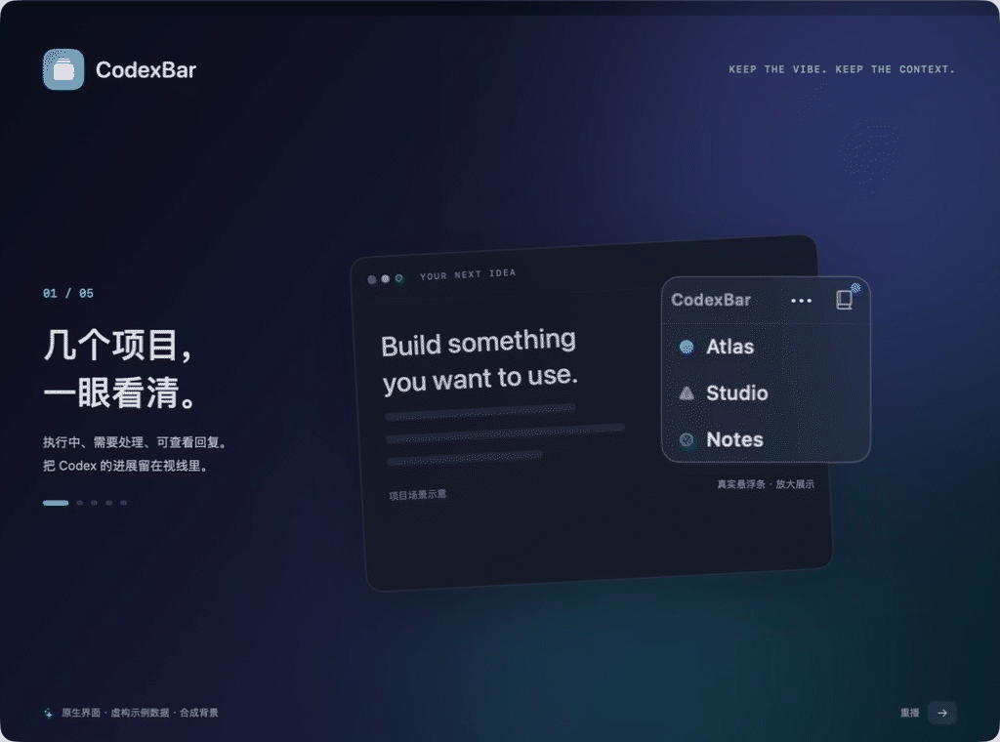
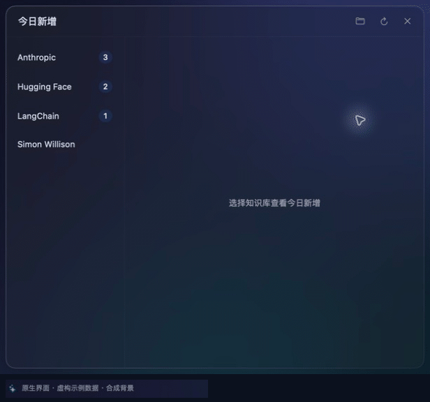

<div align="center">

<h1>CodexBar</h1>

### Codex 在推进，你随时看得见。

一条 macOS 原生悬浮条，汇总 **VS Code 中多个 Codex 项目的进展**；一个独立阅读入口，按 **Obsidian 知识库** 展示今日新文章与摘要。

[](https://github.com/zmylol/CodexBar/actions/workflows/ci.yml) [](#快速开始) [](Package.swift) [](LICENSE) [](PRIVACY.md)

[观看演示](#看看它怎么工作) · [快速开始](#快速开始) · [使用指南](docs/USER_GUIDE.md) · [反馈想法](https://github.com/zmylol/CodexBar/issues)

</div>

## 看看它怎么工作



<sub>实际操作当前原生视图，截取关键帧制成循环动图。项目、会话、文章及到达事件使用虚构样例，背景为独立演示场景，不含个人桌面或真实知识库。<a href="docs/images/demo-poster.png">静态预览</a> · <a href="scripts/marketing-demo/README.md">制作说明</a></sub>

## 四件常做的事，少几次窗口切换

<table><tr><td width="50%" valign="top">

### ◉ 同时看多个项目

集中显示执行中、需要处理和可查看状态。悬浮条可拖动、停靠屏幕四角，任务多时滚动或自动展开。

</td><td width="50%" valign="top">

### ≋ 直接读回复和输出

悬停查看回复，展开命令与工具结果，翻阅历史。支持 Markdown、代码块和文字选择。

</td></tr><tr><td width="50%" valign="top">

### ↗ 点击回到对应项目

恢复并前置对应的 VS Code 窗口，检查改动、验收结果，再给 Codex 下一步指令。

</td><td width="50%" valign="top">

### ◇ 按知识库读今日文章

左侧选知识库，右侧看新文章标题与摘要。点击文章，在 Obsidian 打开全文。

</td></tr></table>

<sub>“可查看”表示当前一轮已停止，可以回看结果；是否达到预期，仍由你验收。</sub>

## 接上你的 Vibe Coding 流程

| 1 · 交给 Codex | 2 · 看进展 | 3 · 验收与迭代 |
| :--- | :--- | :--- |
| 在不同 VS Code 项目里安排任务 | 继续手头工作，扫一眼状态，悬停读回复 | 点击回到项目验收，补充反馈，进入下一轮 |

## 知识库：今天收了什么，一眼读明白

知识库入口独立使用，无需接入 VS Code 任务。自动化可以在一天内分批收录；CodexBar 监听本地文件，按北京时间的 `collected` 日期展示今日文章。

**左侧显示知识库名与未查看篇数；点击清除该库数字，右侧保留文章。** 新文章到达后再次提醒，旧文修改或补写摘要不会重复提醒。

摘要直接读取 Markdown 中已有的摘要首段，没有就只显示标题。CodexBar 不生成或核验摘要，质量取决于写入文章的自动化或工具。[文章格式与提醒规则 →](docs/USER_GUIDE.md#自动化分批收录文章到达就显示)

**想配置自己的每日知识流？** [配置攻略 →](docs/KNOWLEDGE_SETUP.md) 提供目录结构、可复制的文章示例、每日任务提示词，以及摘要写作与复核要求。

<details>
<summary>展开知识库近景演示：选分类、读摘要、新文章提醒</summary>

<p align="center"></p>

<sub>从原生视图实录的关键帧裁切制作，文章和到达事件使用虚构样例数据。</sub>

</details>

**原生磨砂玻璃，适配浅色与深色。** SwiftUI + AppKit 构建，无第三方 Swift Package 依赖。无需 CodexBar 账号，无遥测或主动上传内容的网络客户端；会话预览和知识库正文在内存中处理，任务元数据及偏好保存在本机。官方 Codex 服务遵循其自身数据规则。[隐私说明 →](PRIVACY.md)

## 快速开始

需要 **macOS 13+、Swift 6.0+ 和 Xcode Command Line Tools**。当前通过源码构建安装。

```sh
git clone https://github.com/zmylol/CodexBar.git
cd CodexBar
scripts/install-app
open "$HOME/Applications/CodexBar.app"
```

**使用 VS Code 任务功能：** 再运行 `scripts/install-hooks`，在 Codex 扩展设置中重新加载、审核并信任 Hooks；在 macOS 辅助功能设置中允许 CodexBar 切换窗口。[完整安装步骤 →](docs/USER_GUIDE.md#开始使用)

**只看知识库：** 点书本入口，自动识别或选择 Obsidian 总目录，其一级文件夹作为知识库分类。无需安装 Hooks；文章需带有有效的 `type: article` 和 `collected` 信息。[连接与文章格式 →](docs/USER_GUIDE.md#按知识库查看今日新增文章)

<sub>本地构建使用 ad-hoc 签名，尚未进行 Developer ID 签名或 Apple 公证。更新已有安装时，请先退出 CodexBar；可能需要重新授权辅助功能。</sub>

### 适合你的环境吗？

| 使用场景 | 当前支持 |
| :--- | :--- |
| **macOS + 官方 VS Code Stable + Codex IDE 扩展** | 任务状态、会话预览、项目窗口切换 |
| **Obsidian 知识库** | 按库查看今日收录文章与摘要，可搭配 Codex 桌面端、CLI 或其他工具写入的 Markdown |
| Codex 桌面端 / Codex CLI 的任务和会话 | 暂未接入 |
| Cursor / Windsurf / VS Code Insiders / Windows / Linux | 暂不支持 |

每个 VS Code 窗口对应一个主要项目时体验最好。会话预览依赖扩展的内部本地接口；多窗口歧义、远程任务等边界见[支持范围](docs/USER_GUIDE.md#支持范围)。

<div align="center">

如果它帮你少切了几次窗口，欢迎 **Star**，也欢迎一起改进下一版。

[报告问题](https://github.com/zmylol/CodexBar/issues) · [参与贡献](CONTRIBUTING.md) · [开发与测试](docs/USER_GUIDE.md#开发与贡献) · [架构](docs/ARCHITECTURE.md) · [隐私](PRIVACY.md)

<sub><a href="LICENSE">MIT License</a> · 独立社区项目，与 OpenAI 或 Microsoft 没有隶属或背书关系。相关商标归各自权利人所有。</sub>

</div>
