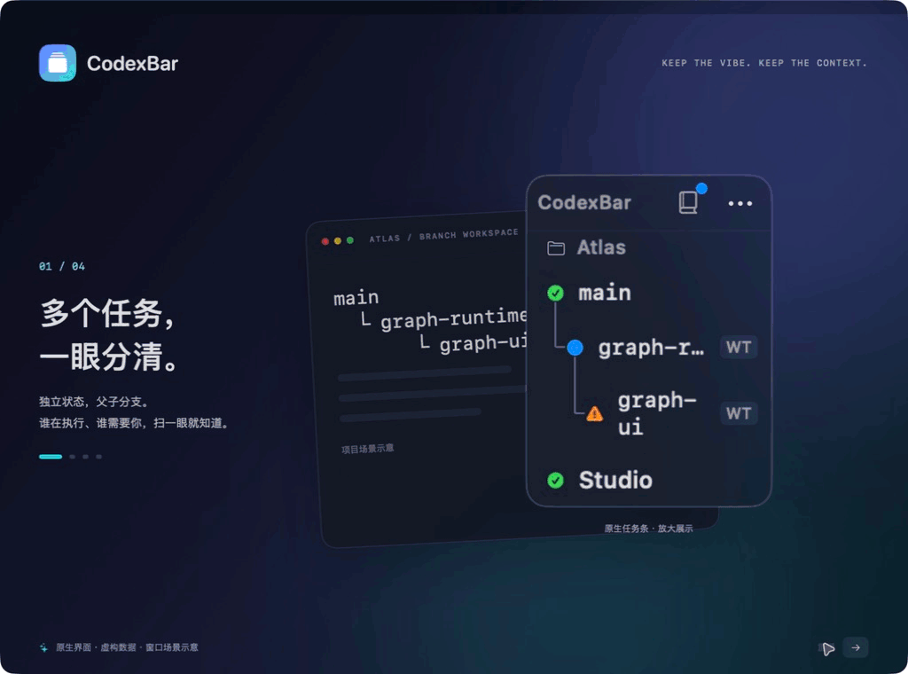

<div align="center">

<h1>CodexBar</h1>

### 看进展，读回复，需要时再接手。

一条 macOS 原生悬浮条，汇总 **VS Code 中多个 Codex 项目的进展**，悬停读回复，点击回项目验收。

另有独立的 **Obsidian 知识库阅读入口**，按库查看文章与摘要，支持今天、昨天和近七天补读。

[](https://github.com/zmylol/CodexBar/actions/workflows/ci.yml) [](#快速开始) [](Package.swift) [](LICENSE) [](PRIVACY.md)

[观看演示](#看看它怎么工作) · [工作区与分支](#工作区与分支并行开发也能分清) · [快速开始](#快速开始) · [知识库配置](docs/KNOWLEDGE_SETUP.md) · [使用指南](docs/USER_GUIDE.md) · [反馈想法](https://github.com/zmylol/CodexBar/issues)

</div>

## 看看它怎么工作



<sub>18 秒动图，由原生界面的实际操作截图剪辑而成。任务与对话均为虚构数据，项目窗口为切换场景示意；录制仅包含独立演示窗口，不含真实桌面或会话。<a href="docs/images/task-demo-poster.png">静态预览</a> · <a href="scripts/marketing-demo/README.md">制作说明</a>。实际窗口切换与专注需要辅助功能授权。</sub>

| 1 · 多项目执行 | 2 · 阅读结果 | 3 · 回项目处理 |
| :--- | :--- | :--- |
| 在不同 VS Code 项目里安排任务，扫一眼执行与等待状态 | 悬停阅读回复，展开工具输出，决定是否接手 | 点击项目名或“切到项目”验收；需要时从项目菜单进入专注 |

## 三个动作，少几次窗口切换

- **同时看多个项目：** 集中显示执行中、需要处理和可查看状态。悬浮条可拖动、停靠屏幕四角，任务多时滚动或自动展开。
- **直接读回复和输出：** 悬停查看回复，展开命令与工具结果，翻阅历史。支持 Markdown、代码块和文字选择。
- **切换与专注，分别选择：** 点击项目名或预览底部“切到项目”，回到对应窗口，保留其他窗口状态。需要专注时，从项目右侧三点菜单或右键菜单选择“专注此项目（最小化其他窗口）”，最小化其他 VS Code 窗口。

<sub>“可查看”表示当前一轮已停止，可以回看结果；是否达到预期，仍由你验收。</sub>

## 工作区与分支：并行开发也能分清

- **按实际打开的工作区显示：** 已有 Codex 会话归到 VS Code 打开的根目录；本地多项目工作区显示一条工作区入口，支持已保存的 `.code-workspace` 和未命名工作区。同一目录在单独窗口与多项目工作区中同时打开时，各自保留入口。
- **自动识别 Git worktree 关系：** 同仓库的工作目录连续显示，仓库名只出现一次。各行以分支短名区分，关联工作树带 `WT` 标记；完整分支名和路径可在详情中查看，无需依赖被截断的项目全名。
- **用树形展示分支来源：** Git 创建记录能确认来源且来源分支窗口也已打开时，父分支在前、子分支缩进连线；从子分支继续创建，也能逐级显示。每个工作目录保留独立状态、详情和窗口切换入口。

例如，下列三个分支的工作目录均已打开，且创建来源可确认时：

```text
example-project
└─ main
   └─ graph-runtime       WT
      └─ graph-ui         WT
```

切换分支后自动更新显示，同仓库整组按最高优先级任务的位置排序。父窗口关闭后，只保留实际打开的子分支；来源可确认时注明“创建自…”，不会生成虚拟任务。

父子线表示**创建时的来源**。创建记录只有 `HEAD`、已经过期或无法确认来源时，保持同仓库平级显示；创建工作树时显式填写本地来源分支名，可留下可识别的记录。窄面板最多向下缩进三级，更深的来源用文字说明。[操作与识别规则 →](docs/USER_GUIDE.md#日常操作)

## 知识库：今天收了什么，一眼读明白

知识库入口独立使用，无需接入 VS Code 任务。自动化可以在一天内分批收录；CodexBar 监听本地文件，按北京时间的 `collected` 日期展示文章。默认查看今天，也可切换到昨天或近七天补读。

<p align="center"></p>

<sub>20 秒看完知识库阅读流程。动图由原生视图的实际操作截图剪辑而成，文章与到达事件均为虚构样例，不含个人桌面或真实知识库。<a href="docs/images/demo-poster.png">静态预览</a> · <a href="scripts/marketing-demo/README.md">制作说明</a></sub>

**左侧显示当前范围内各知识库的未查看篇数；点击清除该库数字，右侧保留文章。** 切换日期范围不会自动清除提醒，近七天的已查看记录在重启后保留。新文章到达后再次提醒，旧文修改或补写摘要不会重复提醒；书本入口只提示今天的新文章。

摘要直接读取 Markdown 中已有的摘要首段，没有就只显示标题。CodexBar 不生成或核验摘要，质量取决于写入文章的自动化或工具。[文章格式与提醒规则 →](docs/USER_GUIDE.md#自动化分批收录文章到达就显示)

**想配置自己的每日知识流？** [配置攻略 →](docs/KNOWLEDGE_SETUP.md) 提供目录结构、可复制的文章示例、每日任务提示词，以及摘要写作与复核要求。

**原生磨砂玻璃，适配浅色与深色。** SwiftUI + AppKit 构建，无第三方 Swift Package 依赖。无需 CodexBar 账号，无遥测或主动上传内容的网络客户端；会话预览和知识库正文在内存中处理，任务元数据及偏好保存在本机。官方 Codex 服务遵循其自身数据规则。[隐私说明 →](PRIVACY.md)

## 快速开始

需要 **macOS 13+、Swift 6.0+ 和 Xcode Command Line Tools**。当前通过源码构建安装。

```sh
git clone https://github.com/zmylol/CodexBar.git
cd CodexBar
scripts/install-app
open "$HOME/Applications/CodexBar.app"
```

**使用 VS Code 任务功能：** 在应用菜单“连接与设置”中选择“安装或更新任务连接…”，或运行 `scripts/install-hooks`，在 Codex 扩展设置中重新加载、审核并信任 Hooks；在 macOS 辅助功能设置中允许 CodexBar 切换窗口。[完整安装步骤 →](docs/USER_GUIDE.md#开始使用)

**只看知识库：** 点书本入口，自动识别或选择 Obsidian 总目录，其一级文件夹作为知识库分类。无需安装 Hooks；文章需带有有效的 `type: article` 和 `collected` 信息。[连接与文章格式 →](docs/USER_GUIDE.md#按知识库查看今日新增文章)

<sub>源码安装使用 ad-hoc 签名，更新前请先退出 CodexBar；可能需要重新授权辅助功能。维护者可按<a href="docs/RELEASING.md">分发流程</a>准备 Developer ID 签名、公证与校验和；尚未完成真实公证的候选不能当作正式发布包。</sub>

**连接遇到问题：** 菜单“连接与设置”显示连接状态和待处理事件，可刷新、打开辅助功能设置或查看[连接指南](docs/USER_GUIDE.md#连接状态与排查)。

### 适合你的环境吗？

| 使用场景 | 当前支持 |
| :--- | :--- |
| **macOS + 官方 VS Code Stable + Codex IDE 扩展** | 任务状态、会话预览、项目窗口切换 |
| **本地多项目工作区** | 按打开的工作区归并已有会话，支持已保存与未命名工作区 |
| **同仓库 Git worktree 并行开发** | 分支分组、独立状态与窗口入口；可确认创建来源时显示父子层级 |
| **Obsidian 知识库** | 按库查看今日收录文章与摘要，可搭配 Codex 桌面端、CLI 或其他工具写入的 Markdown |
| Codex 桌面端 / Codex CLI 的任务和会话 | 暂未接入 |
| Cursor / Windsurf / VS Code Insiders / Windows / Linux | 暂不支持 |

窗口切换要求所选根目录或工作区能够唯一匹配。会话预览依赖扩展的内部本地接口；重复窗口、同名歧义、远程任务等边界见[支持范围](docs/USER_GUIDE.md#支持范围)。

<div align="center">

如果它帮你少切了几次窗口，欢迎 **Star**，也欢迎一起改进下一版。

[报告问题](https://github.com/zmylol/CodexBar/issues) · [参与贡献](CONTRIBUTING.md) · [开发与测试](docs/USER_GUIDE.md#开发与贡献) · [架构](docs/ARCHITECTURE.md) · [隐私](PRIVACY.md)

<sub><a href="LICENSE">MIT License</a> · 独立社区项目，与 OpenAI 或 Microsoft 没有隶属或背书关系。相关商标归各自权利人所有。</sub>

</div>
