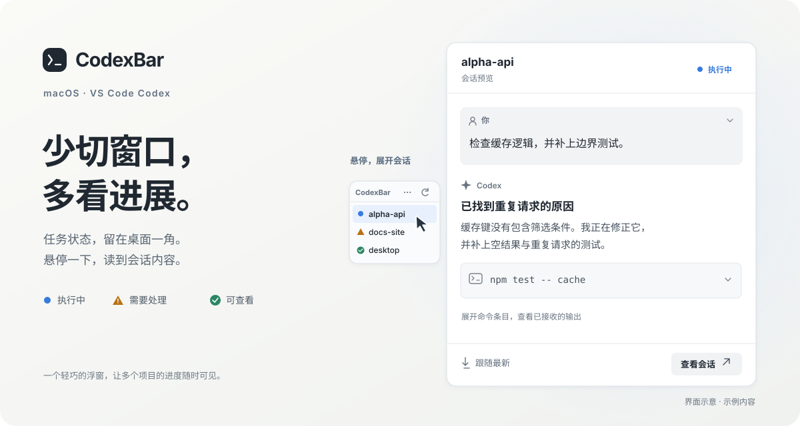

# CodexBar

**少切窗口，多看进展。**

CodexBar 把多个 VS Code 项目的 Codex 任务收进一条 macOS 原生悬浮条。扫一眼，知道哪个项目还在执行、哪个需要你处理；悬停读回复和工具结果，点一下回到项目窗口。

**macOS 13+ · Swift 6 · VS Code · MIT**

[开始使用](#开始使用) · [日常操作](#日常操作) · [支持范围](#支持范围) · [隐私说明](PRIVACY.md) · [参与贡献](CONTRIBUTING.md)



*界面示意，使用虚构项目与示例内容；实际外观随 macOS 设置变化。*

## 让进展留在视线里

同时开着几个项目时，不必挨个切回 Codex 看它进行到哪一步。CodexBar 把这件事缩成三个动作：

| 你想知道什么 | 在 CodexBar 里怎么做 |
| --- | --- |
| **谁还在跑，谁在等我？** | 看悬浮条上的状态图标。项目名常驻，详情按需出现。 |
| **刚才具体做了什么？** | 悬停打开会话预览，直接读助手正文，展开命令与工具结果。 |
| **现在需要我接手吗？** | 点击项目或“查看会话”，恢复并前置对应的 VS Code 窗口。 |

预览支持 Markdown、代码块和文字选择。长会话先展示最近 30 条内容，向上翻阅时分批显示旧消息；新回复默认跟随到末尾，回看历史时保留你的阅读位置。

悬浮条可拖动，也可放到屏幕四角；任务多时选择固定高度滚动，或让列表自动展开。应用使用 SwiftUI 与 AppKit，没有第三方 Swift Package 依赖。

## 开始使用

需要 **macOS 13+、Swift 6.0+、Xcode Command Line Tools**，以及官方 **Visual Studio Code Stable** 和支持 Hooks 的 **OpenAI Codex IDE Extension**。

当前按源码构建安装。构建产物使用本机架构和 ad-hoc 签名，适合本地使用与测试，未经过 Developer ID 签名及 Apple 公证。

### 1. 构建并安装

```sh
git clone https://github.com/zmylol/CodexBar.git
cd CodexBar
scripts/install-app
scripts/install-hooks
```

应用会安装到 `~/Applications/CodexBar.app`，Hook 可执行文件安装到 `~/Library/Application Support/CodexBar/bin/codexbar-hook`。

Hook 安装器会备份并合并现有配置，保留第三方 handler。默认配置路径为 `~/.codex/hooks.json`；设置了 `CODEX_HOME` 时跟随该目录。

### 2. 在 VS Code 中启用 Hooks

重新加载 VS Code，在 Codex 侧栏打开 **Codex settings → Hooks**，必要时点击 **Reload hooks**。打开 **User config**，检查指向 `codexbar-hook` 的命令，再审核并点击 **Trust**。

当前安装器覆盖五种事件：`UserPromptSubmit`、`PreToolUse`、`PermissionRequest`、`PostToolUse`、`Stop`。新增或修改的 Hook 定义需要重新审核后才能运行，详见 [OpenAI 官方 Hooks 文档](https://learn.chatgpt.com/docs/hooks)。

这里使用 IDE 的 Hooks 设置页；CLI 文档中的 `/hooks` 不是 IDE 聊天命令。如果看不到该设置页，先更新扩展，再按 [Hook 兼容性说明](docs/HOOK_COMPATIBILITY.md)检查。

### 3. 启动，允许窗口切换

```sh
open "$HOME/Applications/CodexBar.app"
```

前往 **系统设置 → 隐私与安全性 → 辅助功能**，启用 **CodexBar**，用于同步、恢复和切换 VS Code 窗口。尚未授权时仍可接收和显示已知 Hook 任务，窗口相关功能需要授权后使用。

在已打开的 VS Code 项目里发起一个 Codex 任务，悬浮条就有了可以关注的进展。

**更新已有安装：** 先从悬浮条菜单退出 CodexBar，再运行安装命令。Hook 定义变化后重新审核并加载；重新构建的 ad-hoc 应用也可能需要重新添加辅助功能授权。

## 日常操作

| 操作 | 效果 |
| --- | --- |
| 悬停或键盘聚焦项目 | 打开会话预览 |
| 右方向键 / 菜单“查看会话预览” | 把焦点移入预览，方便滚动和选择文字 |
| 展开用户消息或工具条目 | 阅读收到的正文、命令与输出 |
| 向上翻阅 / “显示较早内容” | 分批显示已接收的旧消息；需要补读时可点“加载较早内容” |
| “回到最新” | 回到末尾并恢复自动跟随 |
| 预览内方向键、Page Up / Down、Home / End | 滚动正文 |
| Esc | 关闭预览；键盘进入时把焦点还给悬浮条 |
| 点击项目 / “查看会话” | 前置对应的现有 VS Code 窗口，并最小化其他标准 VS Code 窗口 |
| 顶部刷新按钮 | 重新扫描已打开窗口中的 Codex 任务 |
| 顶部菜单 | 切换显示模式、移动悬浮条、清理任务或退出 |

窗口切换要求项目与窗口**唯一匹配**，并保留目标窗口原本打开的页面；需要定位具体 Codex 对话时，在该窗口中继续选择。

## 支持范围

| 环境 | 当前支持情况 |
| --- | --- |
| macOS + 官方 VS Code Stable + Codex IDE Extension | 支持本地任务；窗口操作要求辅助功能权限 |
| Codex 桌面端、终端 Codex CLI | 当前不接入，事件会被来源校验过滤 |
| Cursor、Windsurf、VS Code Insiders | 暂不支持 |
| Windows、Linux、远程任务 | 暂不支持 |
| multi-root workspace、同名项目、同一项目多个窗口 | 不保证唯一匹配；有歧义时拒绝切换 |

最适合的使用方式是：**每个 VS Code 窗口打开一个主要项目，项目目录名互不相同。** 成功同步窗口后，列表会隐藏已找不到对应窗口的任务。

会话预览依赖 Codex 扩展的内部本地接口，兼容性会随扩展版本变化。已验证的版本组合、真实传输结果与验证边界见 [会话预览验证报告](docs/CONTENT_PREVIEW_VERIFICATION.md)。

## 状态和正文从哪里来

| 状态 | 含义 |
| --- | --- |
| 🔵 执行中 | 当前任务正在进行 |
| 🔺 需要处理 | 会话等待审批或用户输入 |
| ✅ 可查看 | 当前一轮已停止，可以回看结果；不代表任务一定成功 |

**Hooks 接收任务事件。** 提交、审批请求和停止事件形成三种基本状态；工具开始与完成事件补充活动摘要和审批关联。应用未运行时，生命周期事件仍可进入本地队列。

**本地连接同步当前进展。** CodexBar 跟随可见任务的已知会话，从原 VS Code 会话的 IPC 状态更新等待、恢复执行和停止，也为展开的预览读取消息与工具结果。状态、窗口和队列更新由事件驱动，不再每五秒查询 App Server。

**历史恢复找回已打开的项目。** 启动、手动刷新或窗口变化时，通过官方扩展内置的 Codex App Server 查询 VS Code 线程元数据，只恢复能与现有窗口唯一匹配的任务。实时接口不可用时保留 Hook 路径；能匹配的工具完成事件可恢复执行状态，无法确认的审批保持保守状态。

实现细节见 [架构说明](docs/ARCHITECTURE.md)。

## 内容留在本机

CodexBar 本身没有遥测、账号系统或主动上传数据的网络客户端。

- **任务记录保持精简：** 保存必要的会话标识、项目路径、状态和脱敏后的 prompt 首行摘要；Hook 不归档完整对话。
- **预览正文只放在内存：** 只为当前展开的一个会话保留预览状态，关闭、切换或退出后释放，不写入任务文件或日志。
- **原文按原样展示：** 预览不经过 Hook 摘要的脱敏规则，可能包含会话中的敏感信息。

官方 Codex 组件及服务的数据处理遵循其自身规则。数据字段、保留期限和删除方式见 [隐私说明](PRIVACY.md)。

## 常见问题与边界

**悬浮条没有出现任务？**

先检查应用是否运行、VS Code 是否打开了项目，以及更新后的 Hooks 是否已审核并重新加载。点击顶部刷新可重新扫描窗口。需要验证扩展是否真的派发事件时，再使用可选的 `scripts/install-hooks --probe`，按 [Hook 兼容性测试](docs/HOOK_COMPATIBILITY.md)执行；Probe 不写入正式任务列表，验证后需要切回正式 Hooks 并重新审核。

**预览里缺少内容？**

助手正文和已收到的工具结果可以直接阅读；运行中工具输出可能在完成或刷新后补齐。较早历史需要按需加载，图片和未支持的附件请回原会话查看。预览设有 32 MiB 内容预算及结构上限，超限会提示无法读取；不承诺任意规模的全部内容实时镜像。断线时可保留本次已接收的内容，并提示重试。

**为什么没有恢复某个旧任务？**

历史恢复依赖现有窗口的项目匹配；同名或多窗口场景会保守处理。一次扫描超过 500 条未归档 VS Code 线程时会放弃该次恢复。这是历史恢复的保护上限，与预览消息条数无关。

**如何模拟三种状态？**

将路径换成已经在独立 VS Code 窗口中打开的真实项目路径：

```sh
scripts/send-test-event running /path/to/project-alpha "检查登录流程"
scripts/send-test-event attention /path/to/project-alpha
scripts/send-test-event ready /path/to/project-alpha
```

模拟事件用于验证本地处理链路；真实扩展派发和窗口操作仍需按 [人工验收清单](docs/MANUAL_TEST.md)检查。

## 开发与贡献

这是一个通过 **Vibe Coding** 做出来的小工具，起点很简单：同时让 Codex 处理几个项目时，想少切几次窗口。欢迎带着使用体验、问题复现或 PR 一起把它打磨得更顺手。

| 命令 | 用途 |
| --- | --- |
| `scripts/test` | 完整测试：Swift 核心、Hook、模拟端到端、release bundle 与隔离安装 / 卸载 |
| `scripts/test-preview-performance` | 独立的预览状态、原生滚动和性能检查，需要已登录的 macOS 图形会话 |
| `scripts/build-app` | 只构建本机架构的应用 bundle |
| `scripts/install-app` | 构建并安装应用与 Hook 可执行文件 |

核心测试使用兼容独立 Xcode Command Line Tools 的 `codexbar-tests` 可执行目标，请使用 `scripts/test`，不要用 `swift test` 代替。

[贡献指南](CONTRIBUTING.md) · [架构说明](docs/ARCHITECTURE.md) · [人工验收](docs/MANUAL_TEST.md) · [安全问题报告](SECURITY.md)

## 卸载

```sh
# 卸载应用和 CodexBar 管理的 Hooks，保留本地数据
scripts/uninstall-app

# 同时删除任务、事件及备份（不可恢复）
scripts/uninstall-app --purge-data
```

以上两种方式按需选择。只移除 Hooks 可运行 `scripts/uninstall-hooks`；窗口偏好、系统授权和完整配置恢复方式见 [隐私说明](PRIVACY.md#删除数据)。

## License

[MIT](LICENSE)。CodexBar 是独立的社区工具，与 OpenAI 或 Microsoft 没有隶属或背书关系；相关商标归各自权利人所有。
